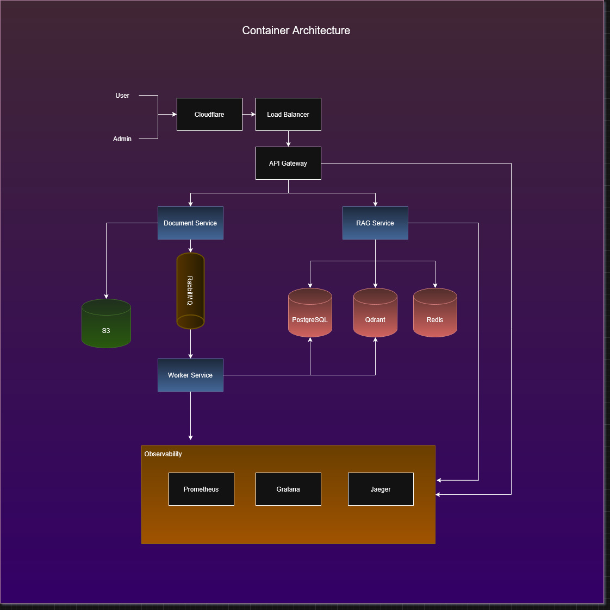
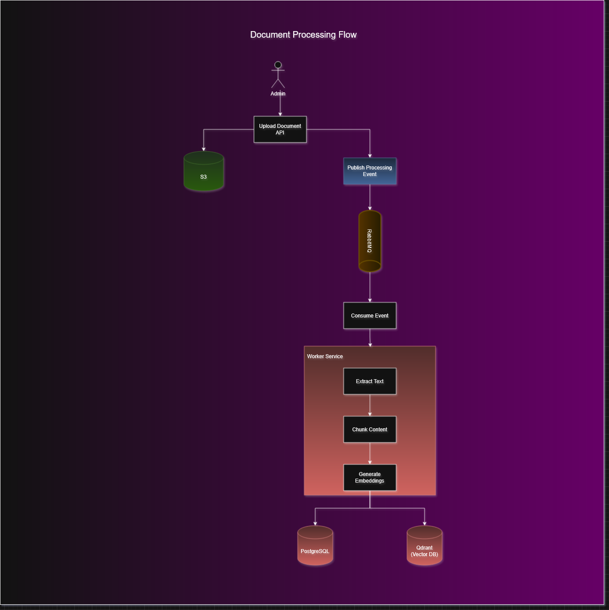
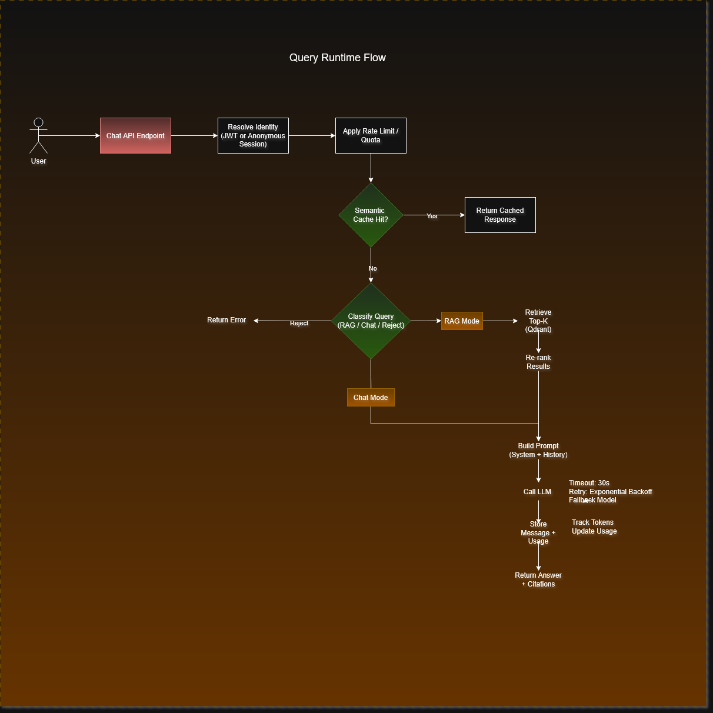

# Vectrion Architecture

## Overview

Vectrion is designed as a production-ready RAG platform with:

- Event-driven document ingestion
- Multi-mode query execution (Chat + RAG)
- Semantic caching
- Rate limiting and quota control
- Usage tracking
- Scalable worker architecture

---

## Diagram Index

1. Container Architecture – System-level component view

2. Document Processing Flow – Async ingestion pipeline

3. Query Runtime Flow – Chat/RAG execution logic

