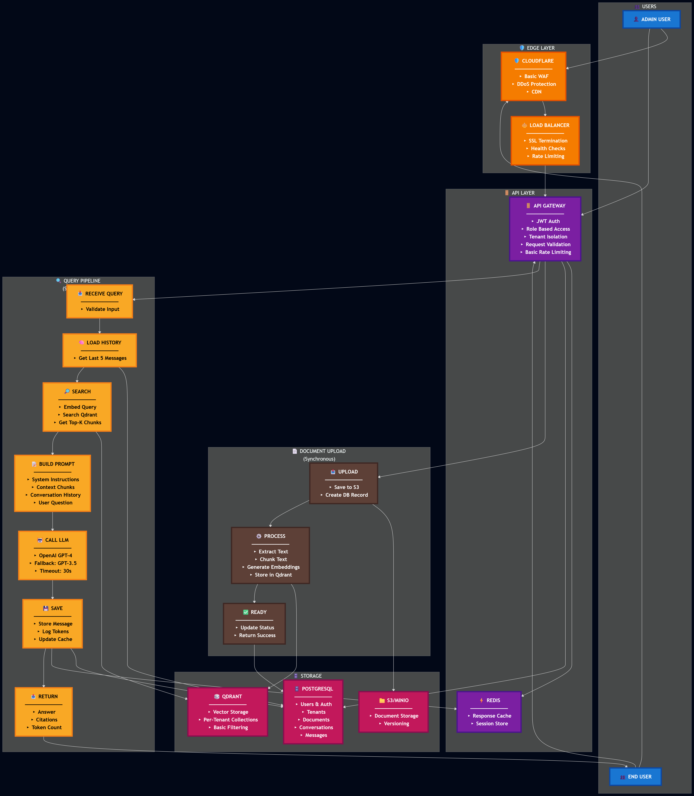
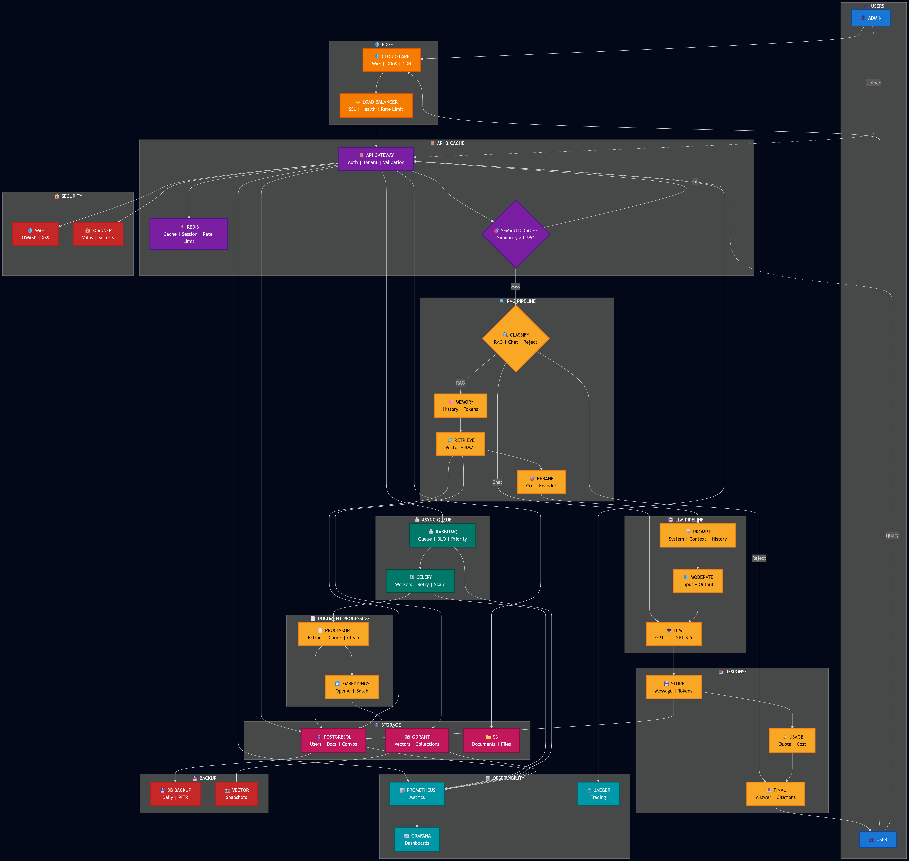

# Vectrion Architecture Overview

This document compares:

1. Basic RAG Architecture (Prototype Level)
2. Production-Grade RAG Architecture (Vectrion)

The goal is to clearly show the evolution from a simple implementation to a production-ready system.

1. Basic RAG Architecture (Prototype Level)

2. Production-Grade RAG Architecture (Vectrion)

